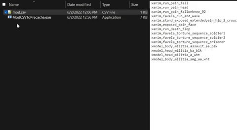

<h1 align="center">
   
   mod.csv To Precache
   
</h1>

  
  
  

<h4 align="center">Convert Your mod.csv To The Precache Format Fast</h4>

  

## Installation

1. [Download](https://github.com/kruumy/mod.csv-to-precache/releases/latest) latest version.
2. Drag your mod.csv onto the executable.
4. Done!
                                                                   
